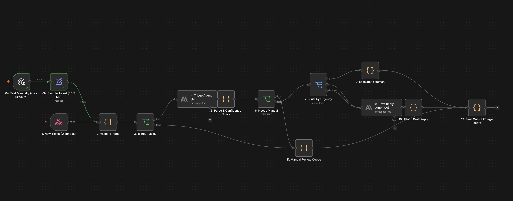
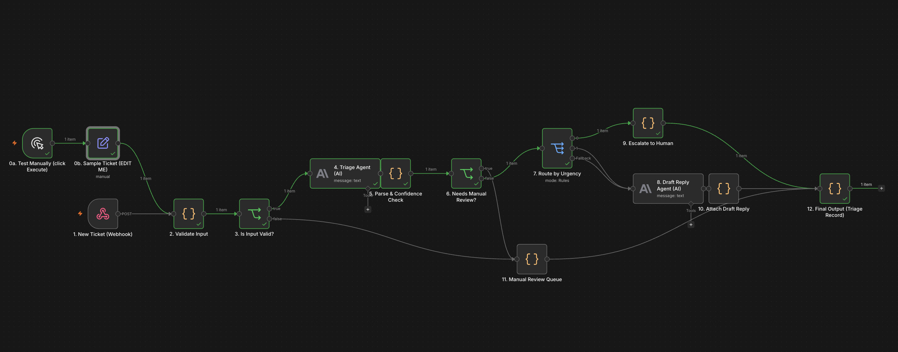
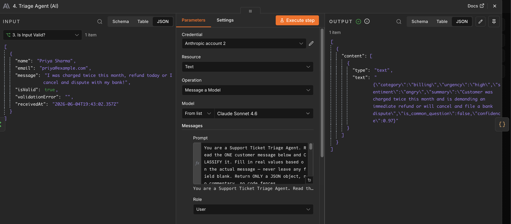
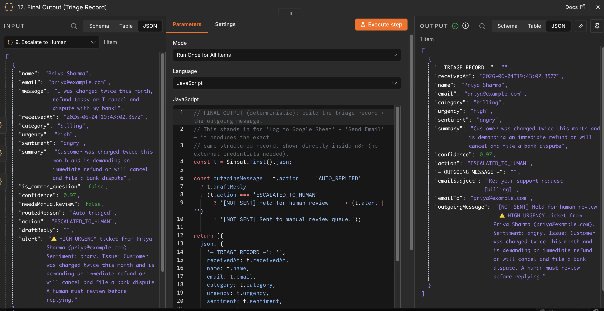
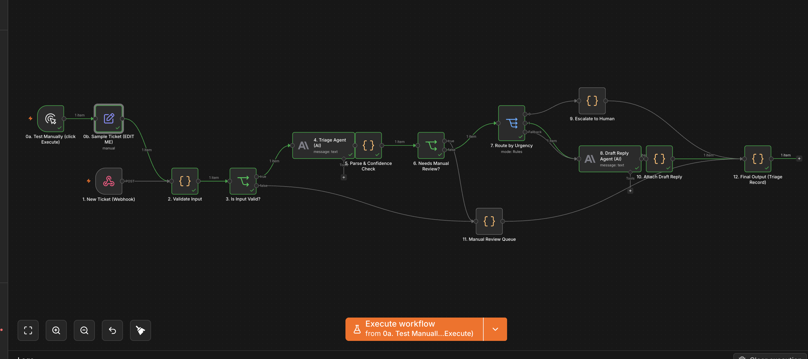

# Support Ticket Triage & Auto-Reply — Agentic n8n Workflow

An AI-powered workflow that reads incoming customer support tickets, understands them,
decides how urgent they are, routes them to the right place, drafts replies for simple
cases, and escalates risky ones to a human — built in **n8n** using agentic design practices.

---

## 1. Problem Statement

**Who is the user?** Customer-support teams at any company that receives messages by
email, web form, or chat.

**The pain point.** Tickets arrive constantly and messily. A human has to read *every*
message, figure out what it's about, judge how urgent it is, and route it to the right
team. Doing this manually is:

- **Slow** — angry, urgent customers wait in the same queue as "how do I log in?"
- **Error-prone** — billing questions get misrouted to the tech team and bounce around.
- **Wasteful** — ~40% of tickets are repetitive FAQs a system could answer instantly.
- **Inconsistent** — different agents categorize and prioritize differently.

**Why it matters.** Slow and misrouted responses make customers angrier and increase churn,
while agents burn out sorting instead of solving.

**What the workflow produces.** For every incoming ticket it outputs a structured triage
record — `{category, urgency, sentiment, summary, confidence, action}` — and then either
(a) auto-sends a drafted reply, (b) escalates to a human, or (c) sends it to a manual-review
queue. Every ticket is logged to a Google Sheet.

---

## 2. Workflow Overview

```
[1] New Ticket (Webhook)
        |
[2] Validate Input (deterministic)
        |
[3] Is Input Valid? --no--> [11] Manual Review Queue
        | yes
[4] Triage Agent (AI)  --> returns JSON {category, urgency, sentiment, summary, confidence}
        |
[5] Parse & Confidence Check (deterministic)
        |
[6] Needs Manual Review? --yes--> [11] Manual Review Queue
        | no
[7] Route by Urgency (Switch)
   |              |                    |
 HIGH        COMMON Q             everything else
   |              |                    |
[9] Escalate   [8] Draft Reply Agent (AI)
  to Human         |
   |          [10] Attach Reply
   |               |
   +-------+-------+----------------+
           |
[12] Log to Google Sheet  -->  [13] Send Email to Customer
```

---

## 3. Node-by-Node Explanation

| # | Node | AI or Deterministic | What it does |
|---|------|---------------------|--------------|
| 1 | New Ticket (Webhook) | Deterministic | Entry point. Receives ticket JSON (`name`, `email`, `message`). |
| 2 | Validate Input | Deterministic | Checks required fields + valid email format. Sets `isValid`. |
| 3 | Is Input Valid? (IF) | Deterministic | Invalid input → straight to manual review (**fallback**). |
| 4 | **Triage Agent** | 🧠 **AI** | **Role: Extractor + Classifier.** Reads the message, returns strict JSON. |
| 5 | Parse & Confidence Check | Deterministic | Safely parses JSON, validates fields, applies a `confidence >= 0.6` **threshold**. |
| 6 | Needs Manual Review? (IF) | Deterministic | Junk/low-confidence AI output → manual review (**fallback**). |
| 7 | Route by Urgency (Switch) | Deterministic | **Routing:** high / common-question / everything-else. |
| 8 | **Draft Reply Agent** | 🧠 **AI** | **Role: Reply Drafter (Recommender).** Writes a customer-ready reply. |
| 9 | Escalate to Human | Human-in-the-loop | High-urgency/angry tickets are flagged for a human before any reply. |
| 10 | Attach Draft Reply | Deterministic | Attaches the AI reply to the ticket record. |
| 11 | Manual Review Queue | Deterministic (fallback) | Catch-all for invalid input or low confidence. |
| 12 | Log to Google Sheet | Tool use | Appends a full triage record for tracking/audit. |
| 13 | Send Email to Customer | Tool use | Sends the drafted reply (or a holding message). |

---

## 4. Where AI is used vs Deterministic logic

- **AI does the reasoning** humans can't reduce to simple rules:
  - *Triage Agent* — understands free-text language → category, urgency, sentiment.
  - *Reply Drafter* — writes a context-aware, polite response.
- **Deterministic logic keeps control** so the system is predictable and safe:
  - Input validation, JSON parsing, **confidence threshold**, urgency **routing**,
    human **escalation**, and **fallback** queues are all plain code/IF/Switch nodes —
    *not* left to the AI.

> Key design principle: **the AI advises, the deterministic nodes decide.** The AI never
> directly controls who gets escalated or what gets auto-sent; code does, based on the
> AI's structured output.

---

## 5. Agentic Practices Demonstrated

- ✅ **Agent roles** — distinct Extractor/Classifier and Reply-Drafter agents.
- ✅ **Structured output** — Triage Agent returns strict JSON.
- ✅ **Tool use** — structured output node + Set/Code integrations (Google Sheets/Gmail-ready).
- ✅ **Routing/branching** — two Switch/IF layers based on workflow state.
- ✅ **Human-in-the-loop** — high-urgency tickets escalate to a person.
- ✅ **Validation & thresholds** — field validation + confidence cutoff.
- ✅ **Fallback handling** — invalid input or low-confidence → manual queue.

---

## 6. Screenshots

**Full workflow (14 nodes):**


**High-urgency ticket escalated to a human:**


**Triage Agent — structured JSON output:**


**Final triage record:**


**Common question — AI-drafted auto-reply:**


---

## 7. Sample Input / Output

See [`sample-input-output.md`](sample-input-output.md) for three worked examples
(an angry billing ticket, a simple FAQ, and a malformed ticket).

---

## 8. How to Run

1. Open n8n (cloud trial at [n8n.io](https://n8n.io), or run `npx n8n` locally).
2. Import `workflow.json` (`...` menu → **Import from File**).
3. On nodes **4. Triage Agent** and **8. Draft Reply Agent**, select your
   **Anthropic (Claude) API credential** (get a key at console.anthropic.com).
4. Test instantly — no webhook or terminal needed: double-click
   **`0b. Sample Ticket`**, edit the ticket text, then double-click
   **`0a. Test Manually` → Execute step**. View the result in node **12**.

---

## 9. Files in this Repo

| File | Purpose |
|------|---------|
| `workflow.json` | The exported n8n workflow (import this). |
| `README.md` | This file — problem statement + workflow explanation. |
| `sample-input-output.md` | Worked example tickets and outputs. |
| `/screenshots` | Workflow + run screenshots. |

---

## 10. Limitations & Future Improvements

- **Human-in-the-loop is simulated** via a notification node. A production version would
  use n8n's *Wait* node to pause until an agent approves/edits the reply.
- **No deduplication** — repeat tickets from the same user aren't merged.
- **Single language** — prompts assume English; multilingual routing could be added.
- **Confidence is self-reported** by the AI; a second verifier agent could cross-check.
- **Replies are auto-sent** for common questions; a stricter setup would require approval
  for all outgoing email.
